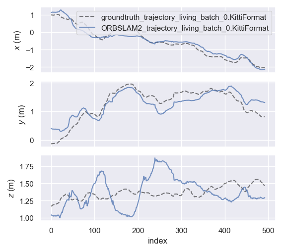
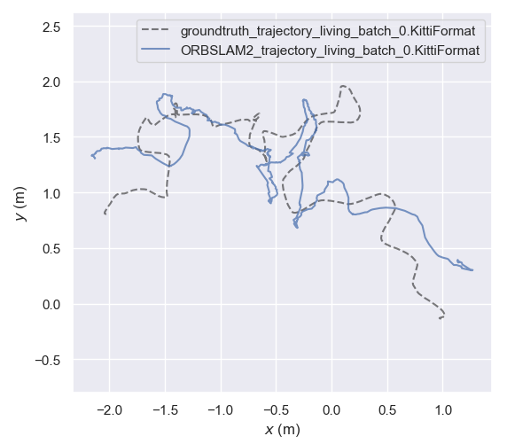
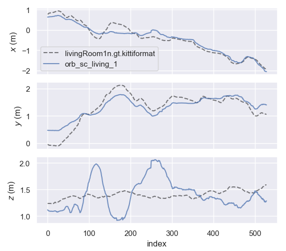
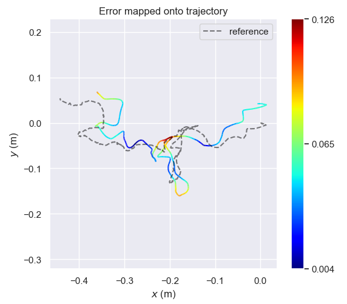
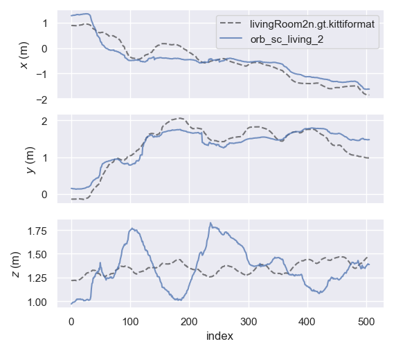
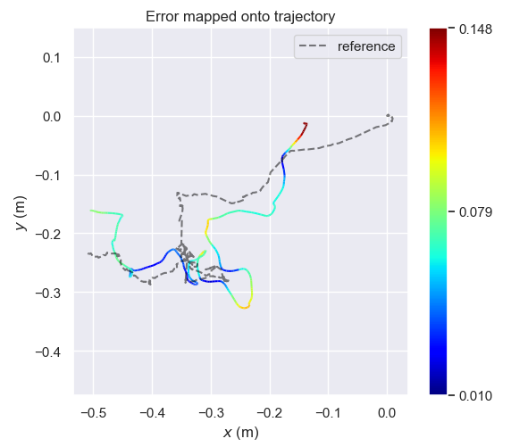

# Master Thesis Project scripts and Evaluations store

## 1. ORB SLAM 2 with SC depth
- These observations are from using ORBSLAM2 with 12 scenes dataset.
- Depthmaps are generated with pretrained SC Depth model.
- SC Depth model is trained on indoor nyu2 dataset.

## Living Room Split 0 (493 frames)

Individual Axis'             |  XY Trajectory
:-------------------------:|:-------------------------:
 |  

EVO_APE Evaluation:

Max | Mean | Median | Min | RMSE | SSE | std
--- | ---  | ---    | --- |---   |---  |--- 
0.105639 | 0.054230 | 0.051419 | 0.010459 | 0.058585 | 1.692088 | 0.022165

### Living Room Split 1 (529 frames)

- Ground truth path length: 9.458m
- orbslam path length: 10.466m

Individual Axis'             |  XY Trajectory
:-------------------------:|:-------------------------:
 |  

EVO_APE Evaluation:

Max | Mean | Median | Min | RMSE | SSE | std
--- | ---  | ---    | --- |---   |---  |--- 
0.126153 | 0.054854 | 0.048657 | 0.003954 | 0.061858 | 2.024148 | 0.028589

### Living Room Split 2 (506 frames)

- Ground truth path length: 8.513m
- orbslam path length: 10.253m

Individual Axis'             |  XY Trajectory
:-------------------------:|:-------------------------:
 |  

EVO_APE Evaluation:

Max | Mean | Median | Min | RMSE | SSE | std
--- | ---  | ---    | --- |---   |---  |--- 
0.148238 | 0.068421 | 0.065743 | 0.010298 | 0.074746 | 2.826994 | 0.030092

## 2. ORB SLAM 2 with GT Depth

EVO_APE Evaluation:

Max | Mean | Median | Min | RMSE | SSE | std
--- | ---  | ---    | --- |---   |---  |--- 
0.0853 | 0.05612 | 0.015743 | 0.010098 | 0.010312 | 1.5262 | 0.020760

## Evaluation of Proposed algorithm

### 1. Init results
The results are created by **evaluating gradslam trajectory wrt trajectory got by orb-slam2**. Both of the architectures have been backed by pre-trained SC depth model.  
In next iteration, the gradients from gradslam shall backprop all the way to SC Depth model, so as to refine the depth model. 

Max | Mean | Median | Min | RMSE | SSE | std
--- | ---  | ---    | --- |---   |---  |--- 
0.004351 | 0.002895 | 0.003136 | 0.000000 | 0.003178 | 0.000081 | 0.001312
